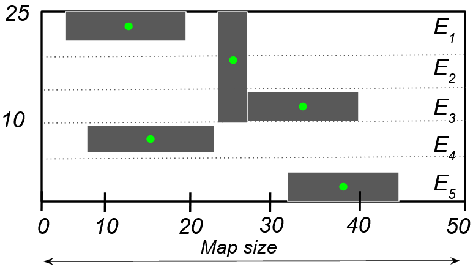

<p align="center">
	
</p>
<h1 align="center">
	AmbieGen Autonomous System Testing Framework
</h1>

<p align="center">
  <b>Current Framework Version: 0.1.0</b>
</p>

[](https://github.com/swat-lab-optimization/AmbieGen-tool/issues)


[](https://hits.seeyoufarm.com)
[](https://opensource.org/licenses/MIT)
<!--
  [](http://hits.dwyl.com/swat-lab-optimization/AmbieGen-tool) -->
The framework, along with some initial results, is covered in the paper [A search-based framework for automatic generation of testing environments for cyber–physical systems](https://www.sciencedirect.com/science/article/pii/S0950584922000866). This paper should be cited if code from this project is used in any way:
```
@article{HUMENIUK2022106936,
title = {A search-based framework for automatic generation of testing environments for cyber–physical systems},
journal = {Information and Software Technology},
volume = {149},
pages = {106936},
year = {2022},
issn = {0950-5849},
doi = {https://doi.org/10.1016/j.infsof.2022.106936},
author = {Dmytro Humeniuk and Foutse Khomh and Giuliano Antoniol}
}
```
## Installation
1. Clone this repository to your local machine.
2. To install the dependencies needed to use the project, run  
```
pip install -r requirements.txt
```  

 from inside the repository folder. Python 3.8 + is required.
3. Now AmbieGen is ready to use. Check the [following section](https://github.com/swat-lab-optimization/AmbieGen-tool#usage) on how to use it.

## Usage
1. You can start the test case generation process by running from inside the repository the ```optimize.py``` module: 
    ```
    python optimize.py 
    ``` 
2. By default a one run of test case generation for autonomous vehicles with NSGA-II will be completed.
2. You may want to change the paramenters of the problem, such as the type of the system under test, the algorithm to use and the number of runs to perform. To do so, you can provide the argumets to the script. All the available arguments are listed in the table below:
<center>

| Argument      | Description                      | Possible values |
| :-------------: |:-------------------------------: | :---------------:|
| problem      |test scenario generation problem | robot, vehicle (default=vehicle) |
| algo      | test sceanrio generation algorithm | ga, nsga2, random (default=nsga2) |
| runs | number of times to run the algorithm      |  an integer value (default=1) |
| save_results | whether to save results data and images     |  True, False (default=True) |
| seed | random seed value    |  an integer value (default=None)|
|debug | whether to print debug data to the log file    |  True, False (default=False)|

</center>

3. Here is an example of how to run the script with the arguments. In this example, the script will run the NSGA-II algorithm for 10 times for the vehicle problem and save the results.
```
python optimize.py --problem vehicle --algo nsga2 --runs 10
```
4. You can also change the parameters of optimization algorithm as well as the parameters of your problem and the system under test in the ```config.py``` file.  

5. Running the script will start the search algorithms for test case generation and provide the output of the search process in the form of the number of evaluations done, constraint violations and best solutions found.
6. At the output, a test suite of the *N* test cases (30 by default) will be generated and saved in the folder configured in the ```config.py``` file. The additional information about the test suite, such as the fitness of each test case, the average diversity of the solutions as well as well as the convergence of the solutions (best solution found at each generation) will also be saved. By default the name of the algorith is added to the folder name, so you do not have to rename the folder if you run a different algorithm.
7. We can also compare the results produced by the two different search
algorithms via executing the following command:
```
python compare.py --stats_path="stats_nsga2" "stats_random" --stats_names "NSGA-II" "Random"
```

In the *stats_path* argument we specify the paths of the metadata for the
runs we wish to compare and in the *stats_names* the names we assign for the
runs. At the output two boxplots showing the fitness diversity of the
scenarios in the test suites produced over the specified number of runs. Also a plot showing the best values found by the compared search algorithms over the
generations is produced. 

8. More information about the avalable options can be found in the [next section](https://github.com/swat-lab-optimization/AmbieGen-tool#options-and-parameters).

## Options and parameters
1. Currently AmbieGen supports the following systems under test:
- ```robot``` - autonomous robot, navigating in a closed room with obstacles. Test scenario for this system is represented as map with obstacles i.e. vertical and horizontal walls.
- ```vehicle``` - autonomous vehicle that is driving on two lane road. The goal is to test the vehicle Lane Keeping Assist System (LKAS) to ensure that the vehicle stays in the lane given a valid road topology.  The test scenario for this system is represented as sequence of points defining the road topology.

    To set one of the systems under test, you can change the ```problem``` variable in the ```main``` function:

    AmbieGen also supports the following algorithms:
- ```ga``` - a singe-objective genetic algorithm, where the fitness is defined by the performace of the simplified model of the system under test on a given test case. The worse the performance, the better the fitness.
- ```nsga2``` - a multi-objective genetic algorithm, where the first fitness function is defined by the performace of the simplified model of the system under test on a given test case and the second - by diversity of the test case, compared to the diversity of the 5 best solutions found.
- ```random``` - a random search algorithm.

    The implementation of these algorithms is based on the [Pymoo framework](https://pymoo.org/).

    To set one of the systems under test, you can change the ```algo``` variable in the ```main``` function.

      

2. In the ```config.py``` file you can specify the parameters of algorithm in the ```ga``` section, as in the example:
    ```python
    ga = {"pop_size": 150, "n_gen": 200, "mut_rate": 0.4, "cross_rate": 0.9, "test_suite_size": 30}
    ```
    Here the ```population size``` is set to 150, the ```number of generations``` to 200, the ```mutation rate``` to 0.4 and the ```crossover rate``` to 0.9.

    In the ```vehicle_env``` and ```robot_env``` sections you can specify the parameters of the system under test, such as the map size, the minimal and the maximal possible values of the attributes. An important parameter is ```elem_types``` which is used to calculate the novelty. It specifies the number of environmental elements types. For example, for autonomous vehicle we have 3 types of road segments: straight, left and right. So the ```elem_types``` is set to 3. 

    In the ```files``` section you can specifie the folders to save the output files such as the statistics about the generated test cases (```stats_path```), the generated test cases (```tcs_path```) and the images of the generated test cases (```images_path```).

## Representation of the test cases

The test cases are represented as a list of environmental elements, as outlined in our article. Each element is represented as a list of $N$ values, where $N$ is the number of attributes of the element.

- For the autonomous robot problem we have 3 attributes: the type of obstacle (0 - horizontal wall, 1 - vertical wall), the size of the obstacle and the x coordinate of the obstacle.  
Consider an example below. You can see a test case represented as a map with 5 obstacles. Each environmental element, which is 5x50 area of the map, contains only one obstacle. Obstalce position is defined as the x coordinate of its center.

    <p align="left">
	
    </p> 

    We can encode it as presented in the table below:

    ...                | E<sub>1</sub>  | E<sub>2</sub>| E<sub>3</sub> | E<sub>4</sub> | E<sub>5</sub> | 
    -------------      | ----| ---      |--- |----|----|    
    obstacle type      |  0  |  1       | 0  | 0 |  0  |
    obstacle size      |  15 | 10       | 10 |  15  |  10    |
    obstalce position  |  12 | 25       | 35 |   15 |  38  |

* For the autonomous vehicle we have 3 attributes too: the type of the road segment (0 - straight, 1 - turning right, 2 - turning left segmets), the length of the straight road segment, the angle of the turn of the turining road segment. Below you can see an example of the test case, which is represented a road topology composed of 5 road segments. 
    <p align="left">
    
    </p> 

    We can encode it as presented in the table below:

    ...          | E<sub>1</sub>  | E<sub>2</sub>| E<sub>3</sub> | E<sub>4</sub> | E<sub>5</sub> | 
    -------------         | ----| ---| ---|--- |----|    
    road type             |  0  | 1  | 1  |  2 |  0 |
    straight road lenght  |  15 | -  | -  | -  | 5  |
    turning angle         |  0  | 60 | 60 | 75 |  0 |


## Adding a new problem
Our fameowork can be easily extended to support a new system to test. To do so, you need to implement the following:  
* ```YourProblem``` class. As an example you can refer to the classes implemented in the [```problems``` section](https://github.com/swat-lab-optimization/AmbieGen-tool/tree/main/ambiegen/problems). In this class you specifie the constraints of your problem as well as indicate the mecanism to calculate the fitness functions.
* ```YourSampling``` class. As an example you can refer to the classes implemented in the [```samplers``` section](https://github.com/swat-lab-optimization/AmbieGen-tool/tree/main/ambiegen/samplers). In this class you specify how to generate the initial population of the algorithm and add the function to produce a random solution.
* ```YourCrossover``` and ```YourMutation``` classes. As an example you can refer to the classes implemented in the [```search_operators``` section](https://github.com/swat-lab-optimization/AmbieGen-tool/tree/main/ambiegen/search_operators). In these classes you specify how to perform the crossover and mutation operations.
* ```YourSolutuion``` class. As an example you can refer to the classes implemented in the [```solutions``` section](https://github.com/dgumenyuk/AmbieGen_tool/tree/main/ambiegen/solutions). In this class you should implement the fitness evaluation function, novelty calculation as well as the function for building the plot of the test case:
    ```python
    def eval_fitness(self):
        """
        This function returns a fitness score
        """
        ...
    def compare_states(self, state1, state2):
        """
        This function compares two states and returns a similarity score

        Args:
            state1: The first state to compare.
            state2: The state to compare to.
            """
        ...
    def calculate_novelty(self, state1, state2):
        """
        The function calculates the novelty of the test case
        
        :param state1: the current state of the robot
        :param state2: the current state of the robot
        :return: The novelty of the state.
        """
    @staticmethod
    def build_image(states, save_path="test.png"):
        """
        It takes a list of states and saves an image to the specified path

        Args:
          states: The list of states to build the image from.
          save_path: The path to save the image to. Defaults to test.png
        """
    
    ```

## Contributing
Bug reports and pull requests are welcome on GitHub at [https://github.com/dgumenyuk/AmbieGen_tool](https://github.com/swat-lab-optimization/AmbieGen-tool). If you have any questions, please contact me at dmytro.humeniuk@polymtl.ca.

## License
This code is available as open source under the terms of the [MIT License](https://opensource.org/licenses/MIT).    